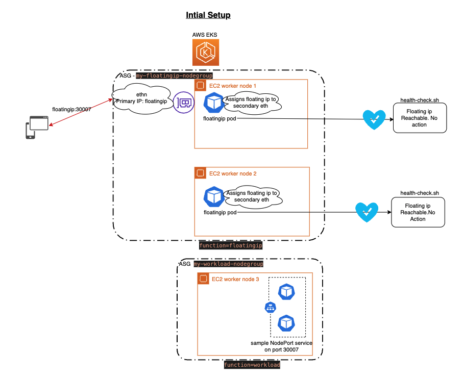
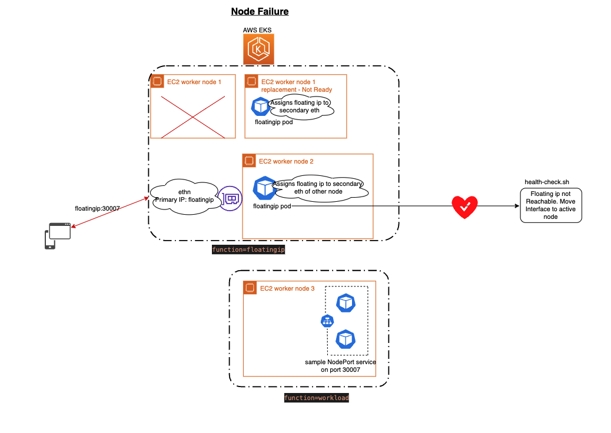
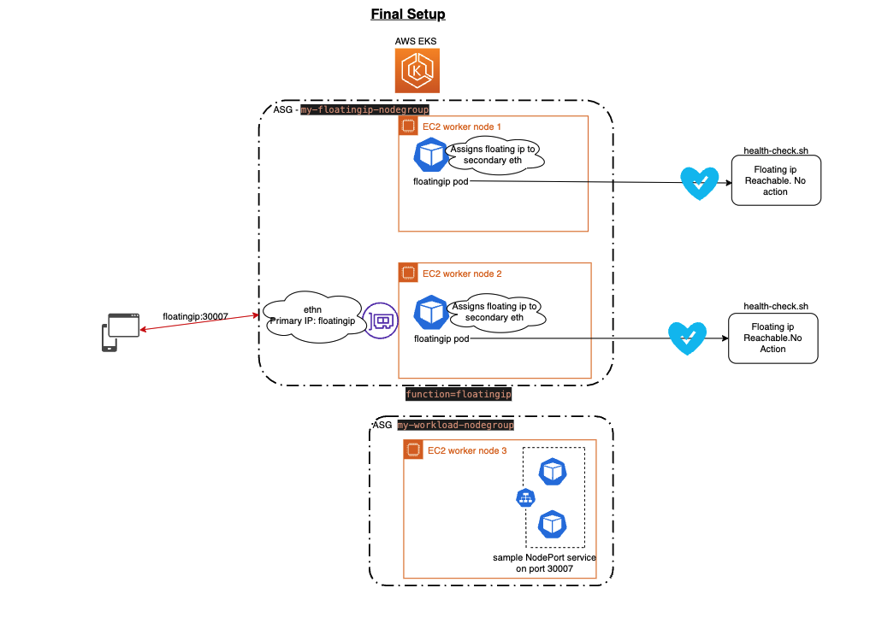

# Floating Ip - High Available NodePort IP Solution in LocalZones/Outpost
## Architecure


 
 

## Introduction

In Local Zones, Outposts , ALB & NLB aren’t offered yet. Customer do not have a choice of native ingress controller. In some use-cases, some applications need to use Node Port as ingress controller. As EKS doesn't give access to EKS control plane, Worker Node IPs are used as Ingress IP.
As Nodes can fail, terminate, scaled down or can get replaced by the AutoScalingGroup, the worker IPs are not fixed, hence the solution is not Highly Available. This proposal provides solution to maintain a Highly Available Node port IP per EKS cluster.

## Solution

Since workers nodes can fail, terminate, scaled down or get replaced by the AutoScalingGroup, we need a solution that gas  Highly available “Floating IP” aka VIP (Virtual IP), that can move from worker Node1 to worker Node 2 , if worker 1 fails. This solution gives 2 advantages.

1. The IP address remains constant and doesn't change 
2. The IP address remains highly available, even if a worker node fails and it remains available till last active worker node.

## overview

To achieve this floating IP solution, we would need to follow the below steps

### Step 1:  Create the EKS cluster

Please refer to EKS documentation for more details - Creating an Amazon EKS cluster (https://docs.aws.amazon.com/eks/latest/userguide/create-cluster.html)

Download the code & sample from the below link https://github.com/aws-samples/ha-nodeport-floatingip-solution-eks-localzone-outpost.git 

Copy AWS CLI credentials 

```
export AWS_ACCESS_KEY_ID=XXXXXXXX
export AWS_SECRET_ACCESS_KEY=XXXXXXX
export AWS_SESSION_TOKEN=XXXXX
```
Retrieve the EKS Optimized AMI ID 

```
export AMI_ID=$(aws ssm get-parameter --name /aws/service/eks/optimized-ami/1.21/amazon-linux-2/recommended/image_id --region us-west-2 --query "Parameter.Value" --output text)
```

Create Sample EKS cluster with 2 managed Node Group. One for running floating IP solution and other for regular workload

```
cd ha-nodeport-floatingip-solution-eks-localzone-outpost
envsubst < eksctl-config.yaml > eksctlconfig.yaml
eksctl create cluster -f eksctlconfig.yaml
```
once cluster is created, set the kubeconfig context to access the EKS cluster
```
aws eks update-kubeconfig --name my-floatingip-democluster --region us-west-2
kubectl get nodes
```

### Step 2: Allocate or Reserve Highly Available Floating IP 

1. A static secondary IP, from the worker’s primary interface  subnet (eth0) is reserved for this usage and no other application can use it.
2. This secondary static IP is later used as the  High available NodePort IP,

To achieve this, retrieve the free IP from the subnet of worker node. 
 Below command will get the list of used ips in the worker node subnet , you can choose any free ip that is not in the list to be floating IP.

### For Ipv4 use:
``` 
export SUBNET_ID=$(aws eks describe-nodegroup --cluster-name my-floatingip-democluster --nodegroup-name my-floatingip-nodegroup --query 'nodegroup.subnets[0]' --output text)
aws ec2 describe-network-interfaces --filters Name=subnet-id,Values="$SUBNET_ID" |jq -r '.NetworkInterfaces[].PrivateIpAddresses[].PrivateIpAddress' | sort -t . -k 3,3n -k 4,4n
```
`export FLOATING_IP=<Any_free_ip_from_above_list>`
### For Ipv6 use:

```
export SUBNET_ID=$(aws eks describe-nodegroup --cluster-name my-floatingip-democluster --nodegroup-name my-floatingip-nodegroup --query 'nodegroup.subnets[0]' --output text)
aws ec2 describe-network-interfaces --filters Name=subnet-id,Values="$SUBNET_ID" |jq -r '.NetworkInterfaces[].Ipv6Addresses[].Ipv6Address'
```
` export FLOATING_IP=<Any_free_ip_not_from_above_list> `

### For Elastic IPs use:
```
export FLOATING_IP=$(aws ec2 allocate-address | jq -r '.AllocationId')
```


### Step 3:  Build Floating Ip image and push image to ECR Repo

```
export AWS_ACCOUNT=$(aws sts get-caller-identity --output text --query 'Account')
aws ecr get-login-password --region us-west-2 | docker login --username AWS --password-stdin ${AWS_ACCOUNT}.dkr.ecr.us-west-2.amazonaws.com
aws ecr create-repository --repository-name amazonlinux_utilities --region us-west-2
docker build -t ${AWS_ACCOUNT}.dkr.ecr.us-west-2.amazonaws.com/amazonlinux_utilities .
docker push ${AWS_ACCOUNT}.dkr.ecr.us-west-2.amazonaws.com/amazonlinux_utilities:latest
```

### Step 4:  Create floatingip deployments & config maps

Create config map with the IP that needs to be persistent for reaching worker nodes.
```
envsubst < floating-ip.yaml > floatingip.yaml
kubectl apply -f floatingip.yaml
```

Floating NodePort IP deployment is a pod with two replicas. This pod will take the pre-selected IP from a configmap and would ensure that the host worker node has this IP address configured on its secondary interface. 

Each pod will have 2 containers :- 
1) Init container - It will create secondary interface with floating ip on pne of the active worker node.
2) floating ip container - It will run in the EKS cluster as an observer. It will run health checks to ensure floating ip is reachable . In case the floating ip is not reachable, this will move the floating ip network interface to other active worker node.

### Step 7: Verify access is working with this HA Nodeport IP
create sample service. 
```
kubectl apply -f sample-service.yaml
```
Connect to my-floatingip-democluster-my-workload-nodegroup-Node node and run below command
``` 
export FLOATING_IP = <floting_ip_per_step_2>
while true; do date; sleep 2; curl --connect-timeout 2 ${FLOATING_IP}:30007; done
```

## Failure Scenarios

Planned failure:

### 1) Deleting the pod - No impact

```
kubectl delete pod floatingip-b896c875f-rd8zk
pod "floatingip-b896c875f-rd8zk" deleted
```

### 2: Cordon node & delete the pod - No Impact
At window keep watching the accessibility of service
```
~ kubectl cordon ip-172-16-50-67.us-west-2.compute.internal
node/ip-172-16-50-67.us-west-2.compute.internal cordoned
➜  ~ kubectl delete pod floatingip-b896c875f-ffg4v
pod "floatingip-b896c875f-ffg4v" deleted
```

### 3) Worst case Failure(Node is replaces):  ~64 secs

Terminate the Node where pod is running (mimicking a node failure due to hardware issues), without any . In this case since this deletion is happening unplanned or a failure case, then we could see that there is a downtime of 2min 14 secs, as the node was terminated without any plan. In this case majority of the downtime is in kubernetes realizing that the node went down.

#### Heath check logs 
 

#### Service reachability logs

 
## Cleanup
```
$kubectl delete -f floatingip.yaml
$kubectl delete -f sampleservice.yaml
```
Detach & delete the interface

```
aws ecr delete-repository --repository-name amazonlinux_utilities --region us-west-2 --force
eksctl delete cluster -f eksctlconfig.yaml
```

## Conclusion

Even though this solution could be implemented by other ways, the health check and failover time is quite significant. Also some applications don’t support DNS and rely on the static IP, so this use case works for both DNS and the fixed IP solution. Also This solution will be faster, reliable and less complex than compared to others, as this lightweight container will fail-over very fast, thereby maintaining the High availability


## License
This library is licensed under the MIT-0 LICENSE. See the LICENSE file.

## Contributors
- Kamal Joshi
